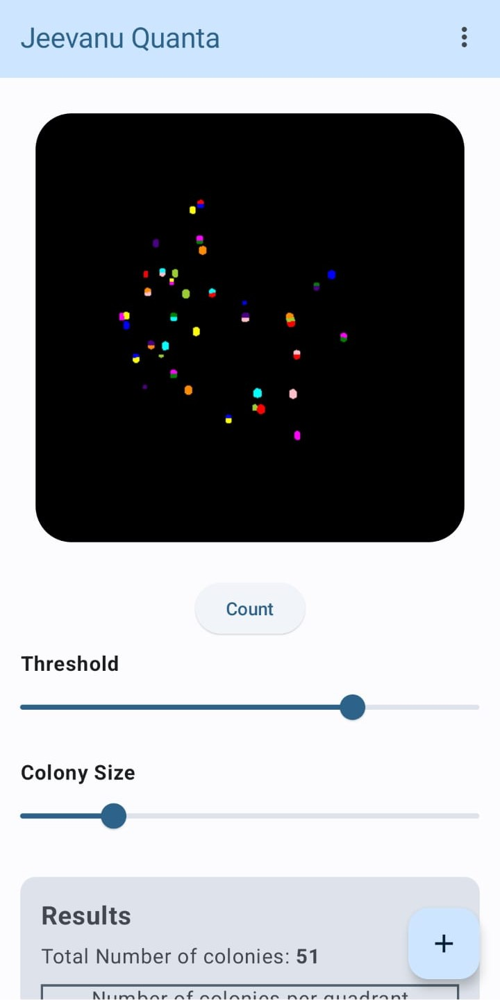

# Jeevanu Quanta
Jeevanu Quanta is an Android app that simplifies bacterial colony counting using advanced computer vision algorithms. With a user-friendly interface powered by Jetpack Compose and Python scripts executed via Chaquopy, this tool allows researchers to easily select images from their gallery and get accurate colony counts. This app is tested with manually counted datasets ensuring precise results. The app runs entirely on-device without internet access. Our app empowers scientists to focus on their studies while making counting colonies much easier and quicker.

# Instructions
## 1. Select Image
- Tap **“+”** FAB
- Choose a photo of your agar plate from your gallery.

  
  

 

## 2. Crop Plate Area
- Use the cropping tool to isolate just the agar region.
  - Exclude background, labels, or hands.  
- Tap **“Crop”** when the plate is fully framed.

  

 

## 3. Adjust Counting Parameters
- **Threshold**:  
  - Slide to set how light/dark the colonies must be to register.  
- **Colony Size**:  
  - Define the smallest colony (in pixels) to include.

  

 

## 4. Count Colonies
- Tap **“Count”**  
- The app processes the image and highlights each detected colony.

  

## 5. Review Results
- **Total Count** and **Per Quadrant Count** are displayed at the bottom.

  

 
